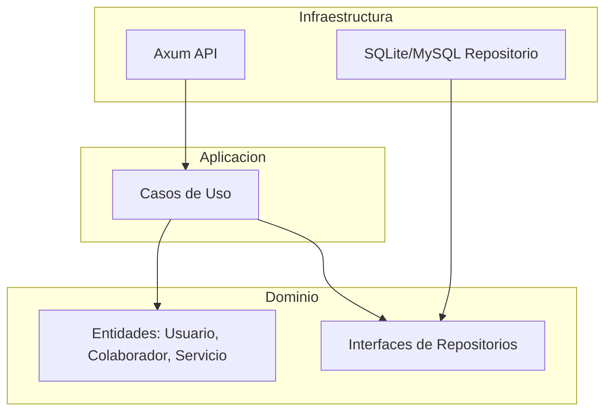

# Arquitectura del Motor Finit

Finit es un motor de marketplace desacoplado diseñado bajo los principios de Clean Architecture. Su objetivo es conectar Usuarios (demandantes) con Colaboradores (ofertores) de manera eficiente.

## Mapa de Dependencias



## Flujo Genérico de Matching

1. **Entrada**: El motor recibe una `SubcategoriaID` y un `ContextoUsuario` (ubicación, filtros).
2. **Filtrado**: El `RepositorioServicio` busca candidatos que cumplan con los criterios base.
3. **Selección (Criterio Genérico)**:
   - Se aplica la fórmula de costo: `PrecioBase(Urgencia) + (Distancia * PrecioKM)`.
   - Se selecciona el candidato óptimo (actualmente el de menor costo).
4. **Resultado**: Creación de una `SolicitudServicio`.

## Componentes de Extensibilidad

| Componente | Rol Genérico | Estado Actual |
| :--- | :--- | :--- |
| **Repositorio** | Adaptador para cualquier motor SQL | Implementado en SQLite |
| **Matching Strategy** | Lógica para elegir al mejor colaborador | Hardcodeado (Precio) |
| **Categorización** | Árbol jerárquico de servicios | Implementado (Lazy Load) |
| **Identidad** | Gestión de Roles (User -> Pro) | Implementado (JWT + Bcrypt) |

## Plano Visual (ASCII)

Este diagrama representa el flujo de datos y la jerarquía de componentes del motor Finit:

```text
       _________________________________________________________________________
      |                                                                         |
      |   [ USUARIO / APP ] <-------- (A) INTERFAZ HTTP / JSON -------> [ RED ] |
      |_________________________________________________________________________|
                                       |
                                       v
      _________________________________________________________________________
     |                                                                         |
     |   [ INFRAESTRUCTURA : API AXUM ]                                        |
     |   ___________________________________________________________________   |
     |  |                                                                   |  |
     |  |  (B) MANEJADORES (Handlers)                                       |  |
     |  |  -------------------------                                        |  |
     |  |  - Valida el JSON de entrada                                      |  |
     |  |  - Orquesta la respuesta HTTP                                     |  |
     |  |___________________________________________________________________|  |
     |_________________________________________________________________________|
                                       |
                                       v
      _________________________________________________________________________
     |                                                                         |
     |   [ APLICACIÓN : CASOS DE USO ]                                         |
     |   ___________________________________________________________________   |
     |  |                                                                   |  |
     |  |  (C) LÓGICA DE NEGOCIO                                            |  |
     |  |  -----------------------                                          |  |
     |  |  - Matching de Colaboradores (Fórmula de Haversine)               |  |
     |  |  - Registro y Login (Bcrypt / JWT)                                |  |
     |  |  - Gestión de Categorías (Lazy Load)                              |  |
     |  |___________________________________________________________________|  |
     |_________________________________________________________________________|
                    |                                       |
                    v                                       v
      ______________|_________________       _______________|_________________
     |                                |     |                                |
     |  [ DOMINIO : ENTIDADES ]       |     |  [ DOMINIO : PUERTOS (Interfaces)]
     |  -----------------------       |     |  ------------------------------|
     |  - Usuario / Colaborador       |     |  - RepositorioCategoria        |
     |  - Servicio / Solicitud        |     |  - RepositorioUsuario          |
     |  - Categoria / Subcategoria    |     |  - RepositorioServicio         |
     |________________________________|     |________________________________|
                                                            |
                                                            v
      ______________________________________________________|__________________
     |                                                                         |
     |   [ INFRAESTRUCTURA : PERSISTENCIA ]                                    |
     |   ___________________________________________________________________   |
     |  |                                                                   |  |
     |  |  (D) ADAPTADOR SQL (SQLite / MySQL)                               |  |
     |  |  ----------------------------------                               |  |
     |  |  - Consultas Crudas (SQLx)                                        |  |
     |  |  - Inicialización de Tablas                                       |  |
     |  |___________________________________________________________________|  |
     |_________________________________________________________________________|
```
